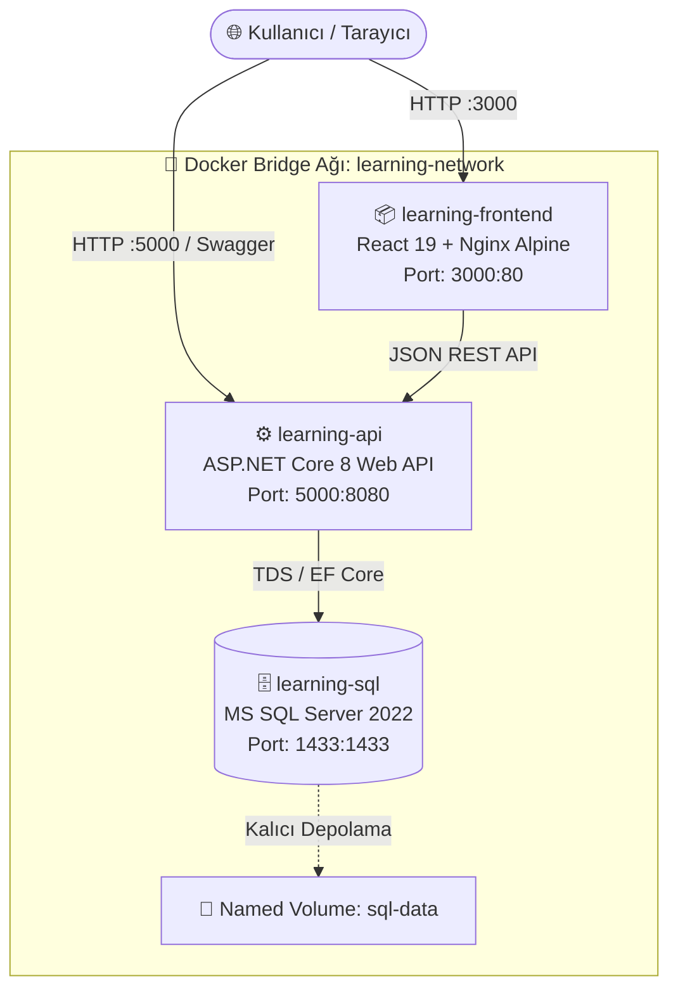

<div align="center">

# 🐳 DockerLearning • Multi-Container Full-Stack Platform

<p align="center">
  <strong>React 19</strong>, <strong>ASP.NET Core 8 Web API</strong> ve <strong>Microsoft SQL Server 2022</strong> teknolojileriyle inşa edilmiş, modern ve üretime hazır multi-container mikro mimari projesi.
</p>

[](https://www.docker.com/)
[](https://dotnet.microsoft.com/)
[](https://react.dev/)
[](https://www.microsoft.com/sql-server/)
[](https://nginx.org/)

<br />

[Mimarisi](#-sistem-mimarisi) •
[Özellikler](#-öne-çıkan-özellikler) •
[Hızlı Başlangıç](#-hızlı-başlangıç-kurulum) •
[API Uç Noktaları](#-api-dokümantasyonu) •
[Docker Detayları](#-docker--container-mimarisi) •
[Geliştirme](#-yerel-geliştirme)

</div>

---

## 📌 Proje Hakkında

**DockerLearning**, modern bulut tabanlı (cloud-native) yazılım geliştirme standartlarını ve **Docker Multi-Container Orchestration** pratiklerini sergilemek amacıyla geliştirilmiş full-stack bir referans projesidir.

Tüm sistem, tek bir `docker compose up` komutuyla ayağa kalkar; frontend, backend ve veritabanı birbirleriyle izole bir Docker ağı üzerinden haberleşir.

```
┌─────────────────────────┐      REST API      ┌─────────────────────────┐       TCP 1433      ┌─────────────────────────┐
│    learning-frontend    │ ─────────────────> │      learning-api       │ ──────────────────> │      learning-sql       │
│  React 19 + TypeScript  │     Port 5000      │   ASP.NET Core 8 Web    │     Port 1433       │   MS SQL Server 2022    │
│      Nginx Alpine       │                    │    EF Core Migration    │                     │  Persistent Named Volume │
│      (Port 3000)        │                    │       (Port 5000)       │                     │       (Port 1433)       │
└─────────────────────────┘                    └─────────────────────────┘                     └─────────────────────────┘
```

---

## ✨ Öne Çıkan Özellikler

### 🐳 DevOps & Konteynerizasyon
- **Multi-Stage Docker Builds**: Frontend (Node.js Build ➔ Nginx Alpine Runtime) ve Backend (SDK 8.0 Build ➔ ASP.NET Runtime) için minimum imaj boyutu ve yüksek güvenlik.
- **Docker Compose Orkestrasyonu**: Servis bağımlılıkları (`depends_on`), ortam değişkenleri (`.env`), izole bridge ağı ve kalıcı disk alanı (`volumes: sql-data`).
- **Otomatik EF Core Migration**: API ayağa kalktığı anda SQL Server veritabanını ve tablolarını otomatik oluşturur (`db.Database.Migrate()`).

### 🚀 Backend (.NET 8 Web API)
- RESTful CRUD mimarisi (`GET`, `POST`, `PUT`, `DELETE`).
- Entity Framework Core Code-First yaklaşımı.
- Swagger / OpenAPI entegrasyonu ile interaktif API test ekranı (`/swagger`).
- Çevreler arası esnek CORS yapılandırması.

### 🎨 Frontend (React 19 + TypeScript + Vite)
- **Glassmorphism & Cyberpunk Dark UI**: Modern tipografi, gradyan ışıma efektleri ve dinamik mikro animasyonlar.
- **Canlı Metrikler & Dashboard**: Toplam ürün sayısı, envanter piyasa değeri, ortalama fiyat ve anlık API gecikme (latency/ping) ölçümü.
- **Zengin CRUD Deneyimi**: Canlı ürün arama, fiyata ve isme göre sıralama, ürün ekleme & düzenleme modalları, grid/tablo görünüm geçişi.
- **Demo Seed Generator**: Portföy sunumlarında tek tıkla gerçekçi örnek ürünler yükleme butonu.
- **Toast Bildirim Sistemi**: İşlem durumları (ekleme, güncelleme, silme, hata) için sağ altta modern toast kartları.

---

## 🏗️ Sistem Mimarisi



---

## 🛠️ Teknoloji Yığını

| Katman | Teknoloji / Kütüphane | Kullanım Amacı |
|---|---|---|
| **Frontend** | React 19, TypeScript, Vite | Hızlı, reaktif ve tipli modern kullanıcı arayüzü |
| **Styling** | Modern CSS3 (Glassmorphism, Grid/Flex) | Özel tasarım sistemi, dark theme ve responsive arayüz |
| **Web Server** | Nginx Alpine | Frontend üretim paketinin (dist) hafif ve yüksek performanslı sunumu |
| **Backend** | .NET 8 (C#), ASP.NET Core Web API | Yüksek performanslı, ölçeklenebilir REST API katmanı |
| **ORM / Data** | Entity Framework Core 8, SqlServer | Veritabanı modelleme, CRUD ve otomatik migrasyonlar |
| **Veritabanı** | Microsoft SQL Server 2022 | Güvenilir ilişkisel veritabanı motoru |
| **Konteyner** | Docker & Docker Compose | Servislerin bağımsız ve izole ortamda çalıştırılması |
| **Dokümantasyon** | Swagger / OpenAPI | API uç noktalarının test edilmesi ve belgelenmesi |

---

## 🚀 Hızlı Başlangıç (Kurulum)

Projeyi makinenizde çalıştırmak için yalnızca **Docker Desktop** ve **Git** kurulu olması yeterlidir.

### 1. Depoyu Klonlayın
```bash
git clone https://github.com/ismaildundar42/DotNet-React-Docker.git
cd DotNet-React-Docker
```

### 2. Ortam Değişkenlerini Tanımlayın
Kök dizinde `.env` dosyasını oluşturun (veya `.env.example` dosyasını kopyalayın):
```bash
cp .env.example .env
```
`.env` dosyasının içeriğinin güçlü bir şifre içerdiğinden emin olun:
```env
MSSQL_SA_PASSWORD=SuperSecretPass123!
```

### 3. Docker Compose ile Başlatın
Tüm konteynerleri derleyin ve arka planda çalıştırın:
```bash
docker compose up --build -d
```

### 4. Servislere Erişin

| Servis | Adres | Açıklama |
|---|---|---|
| 🎨 **Frontend UI** | [http://localhost:3000](http://localhost:3000) | Dashboard & Ürün Yönetim Ekranı |
| 🚀 **Swagger API Docs** | [http://localhost:5000/swagger](http://localhost:5000/swagger) | İnteraktif API Dokümantasyonu |
| 🔌 **Backend API Base** | [http://localhost:5000/api/Products](http://localhost:5000/api/Products) | REST API Endpoint |
| 🗄️ **SQL Server** | `localhost,1433` (User: `sa`) | Veritabanı doğrudan bağlantısı |

---

## 📡 API Dokümantasyonu

### Products Endpoints

| Metot | Uç Nokta | Açıklama | İstek Gövdesi (Body) | Yanıt |
|---|---|---|---|---|
| `GET` | `/api/Products` | Tüm ürünleri listeler | - | `200 OK` (Ürün dizisi) |
| `GET` | `/api/Products/{id}` | Belirtilen ID'ye sahip ürünü getirir | - | `200 OK` veya `404 Not Found` |
| `POST` | `/api/Products` | Yeni bir ürün ekler | `{"name": "MacBook", "price": 85000}` | `201 Created` |
| `PUT` | `/api/Products/{id}` | Mevcut ürünü günceller | `{"id": 1, "name": "MacBook Pro", "price": 95000}` | `204 NoContent` |
| `DELETE` | `/api/Products/{id}` | Ürünü siler | - | `204 NoContent` |

#### Örnek JSON Verisi (POST / PUT):
```json
{
  "name": "Apple MacBook Pro 16 M3 Max",
  "price": 124999.00
}
```

---

## 📂 Proje Dizin Yapısı

```plaintext
DockerLearning/
├── backend/
│   └── DockerLearning.Api/
│       ├── Controllers/          # API Controller katmanı (ProductsController, etc.)
│       ├── Data/                 # AppDbContext & Veritabanı bağlamı
│       ├── Migrations/           # EF Core Migration dosyaları
│       ├── Models/               # Veri modelleri (Product.cs)
│       ├── Dockerfile            # Multi-stage .NET 8 Dockerfile
│       └── Program.cs            # Uygulama başlangıcı, DI, CORS & Migration
├── frontend/
│   ├── public/                   # Statik varlıklar
│   ├── src/
│   │   ├── App.tsx               # Modern React Dashboard & CRUD Mantığı
│   │   ├── App.css               # Glassmorphism & Cyberpunk Tasarım Sistemi
│   │   ├── index.css             # Tipografi & Genel Reset Kuralları
│   │   └── main.tsx              # React DOM kök bileşeni
│   ├── Dockerfile                # Multi-stage Nginx Alpine Dockerfile
│   ├── index.html                # HTML Şablonu & Google Fonts
│   └── vite.config.ts            # Vite yapılandırması
├── .env.example                  # Çevre değişkenleri şablonu
├── compose.yaml                  # Docker Compose orkestrasyon dosyası
└── README.md                     # Proje ana dokümantasyonu
```

---

## 📦 Docker & Container Mimarisi

### Multi-Stage Frontend Dockerfile
```dockerfile
# Aşama 1: Node.js üzerinde derleme
FROM node:22-alpine AS build
WORKDIR /app
COPY package*.json ./
RUN npm ci
COPY . .
RUN npm run build

# Aşama 2: Hafif Nginx Alpine ile sunum (~25MB)
FROM nginx:alpine AS runtime
COPY --from=build /app/dist /usr/share/nginx/html
EXPOSE 80
```

### Multi-Stage Backend Dockerfile
```dockerfile
# Aşama 1: .NET 8 SDK ile derleme & publish
FROM mcr.microsoft.com/dotnet/sdk:8.0 AS build
WORKDIR /src
COPY . .
RUN dotnet restore
RUN dotnet publish -c Release -o /app/publish

# Aşama 2: ASP.NET Core 8 Runtime (~210MB)
FROM mcr.microsoft.com/dotnet/aspnet:8.0 AS runtime
WORKDIR /app
COPY --from=build /app/publish .
ENTRYPOINT ["dotnet", "DockerLearning.Api.dll"]
```

---

## 💻 Yerel Geliştirme (Docker Olmadan)

Projeyi konteyner dışarısında yerel geliştirme modunda çalıştırmak isterseniz:

### Backend Çalıştırma:
```bash
cd backend/DockerLearning.Api
dotnet restore
dotnet run
# API http://localhost:5000 üzerinde dinlemeye başlar
```

### Frontend Çalıştırma:
```bash
cd frontend
npm install
npm run dev
# React Vite geliştirme sunucusu http://localhost:5173 üzerinde başlar
```

---

## 🔧 Sık Kullanılan Docker Komutları

```bash
# Konteynerleri arka planda başlat
docker compose up -d

# Konteyner loglarını canlı takip et
docker compose logs -f

# Yalnızca backend loglarını izle
docker compose logs -f backend

# Tüm servisleri durdur ve konteynerleri kaldır
docker compose down

# Veritabanı hacmi (volume) dahil her şeyi sıfırla
docker compose down -v
```

---

## 🤝 Katkıda Bulunma & İletişim

1. Bu depoyu Fork'layın (`fork`)
2. Yeni bir özellik dalı oluşturun (`git checkout -b feature/YeniOzellik`)
3. Değişikliklerinizi commit'leyin (`git commit -m 'feat: Yeni özellik eklendi'`)
4. Dalınızı push'layın (`git push origin feature/YeniOzellik`)
5. Bir **Pull Request** açın!

---

<div align="center">
  <sub>Geliştirici: <strong>İsmail Dündar</strong> • Docker Learning Ecosystem</sub>
</div>
